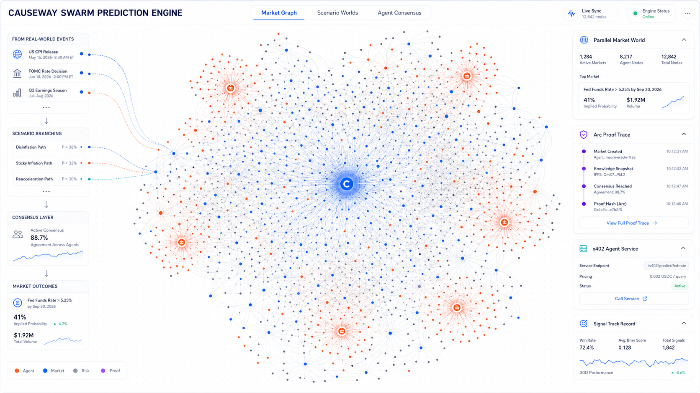
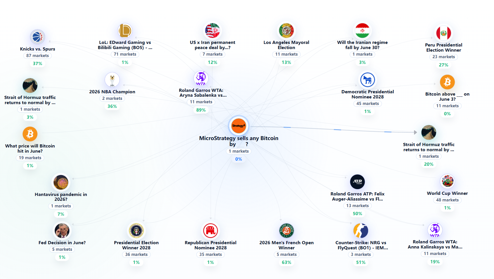

# Causeway

Causeway is a prediction-market intelligence stack built around ARC. It starts from a real Polymarket market, expands the surrounding market graph, runs inspectable AI reasoning, and turns the result into user-reviewed order previews and signal records.

ARC is the trust and payment rail in this architecture. Causeway uses ARC for verifiable USDC premium payments today, and the product thesis centers on ARC-backed audit records, signal track records, and future agent-service settlement. Polymarket remains the trading venue; ARC is not the execution venue.

## Live Links

- Website: https://causeway.market
- App: https://causeway.market/app
- Whitepaper PDF: https://causeway.market/whitepaper.pdf
- Whitepaper Docs: https://causeway.market/docs/

## Product Views

<p>
  
</p>

Causeway keeps ARC proof traces, signal records, market graph exploration, and agent-service access visible in one interface.

## ARC in Causeway

Causeway uses a clear split of responsibilities:

- ARC is the audit and payment substrate for Causeway.
- Polymarket is still the market data and trade execution venue.
- Causeway is the orchestration layer that turns market structure, AI reasoning, and user review into tradable intelligence.
- x402-style services can use ARC as the settlement rail as the service layer expands.

More concretely:

- `Premium payments`: Arc USDC payment intents and backend verification unlock premium capability without changing Polymarket order flow.
- `Review records`: inference runs preserve structured reasoning context so signal quality and decision paths can be reviewed over time.
- `Service settlement`: data, verification, and specialized agent services can settle through ARC as the product grows.
- `Execution boundary`: user signatures and user review stay in control; ARC does not replace Polymarket trade execution.

## Product Principles

Causeway is built on three product principles:

- `Market-native`: Causeway models real events, markets, outcomes, liquidity, and rules instead of treating a market as plain text.
- `Reasoning-visible`: AI output is expected to preserve assumptions, confidence, risk flags, and the path from market data to a recommendation.
- `User-governed`: order execution remains behind explicit wallet review and user signatures by default.

## What It Does

- Syncs Polymarket markets, outcomes, order books, and account context.
- Builds a market graph around a selected root market, event, or topic.
- Runs AI inference from a root market into related candidate markets.
- Produces causal scripts, graph views, and guarded order candidates.
- Preserves structured reasoning context so signal quality can be reviewed over time.
- Supports Arc USDC premium membership payments without changing the trading flow.
- Keeps execution behind explicit user confirmation instead of black-box auto trading.
- Serves the app, marketing site, and browsable whitepaper/docs from the same frontend repository.

<p>
  
</p>

From one root market, Causeway expands related events, outcomes, and causal links into a market network that can be reviewed before action.

## Whitepaper Themes

The whitepaper is available both as a PDF and as chaptered docs under `/docs/`. It focuses on three ARC themes:

- `Arc Proof and Signal Track Record`: prediction-market reasoning should be reviewable before outcomes resolve.
- `Arc USDC Economy`: premium capabilities and verifiable payments should use a stablecoin-native payment rail.
- `x402 Agent Service Layer`: data, verification, and specialized-agent calls should use machine-readable paid access, not trading execution.

Together, these themes define how Causeway combines market intelligence, reviewable reasoning, and verifiable payment rails.

## Repository Layout

```text
.
|-- src/                 # React/Vite frontend app
|-- apps/api/            # NestJS API, Prisma schema, tests, integrations
|-- public/marketing/    # Static marketing entry
|-- public/docs/         # Static docs/whitepaper entry
|-- public/whitepaper/   # Public whitepaper PDF
|-- public/assets/       # Static marketing assets
|-- scripts/dev/         # Local helper scripts
`-- dist/                # Production build output, generated locally
```

## Tech Stack

- Frontend: React 19, Vite, TypeScript, Wagmi, RainbowKit, React Query, XYFlow.
- Backend: NestJS, Prisma, PostgreSQL, BullMQ/Redis optional scheduling, Vitest.
- Market integrations: Polymarket Gamma, CLOB, Data API, Builder/Relayer flows.
- AI integration: configurable OpenAI-compatible inference endpoint.
- ARC integration: Arc Testnet chain config, Arc RPC override support, Arc USDC payment verification.
- Deployment: static frontend on Cloudflare Pages, API as a Node/NestJS service.

## Local Development

Install dependencies:

```bash
npm install
```

Create local environment files from the examples:

```bash
cp .env.example .env
cp apps/api/.env.example apps/api/.env
```

For Windows PowerShell:

```powershell
Copy-Item .env.example .env
Copy-Item apps/api/.env.example apps/api/.env
```

Start the frontend:

```bash
npm run dev:web
```

Start the API in another terminal:

```bash
npm run dev:api
```

The app defaults to:

- Frontend: http://localhost:5173
- API: http://localhost:8000/api/v1

Open the app at:

```text
http://localhost:5173/app
```

## Environment Configuration

Root frontend variables:

```text
VITE_API_BASE_URL=
VITE_WALLETCONNECT_PROJECT_ID=
VITE_ARC_RPC_URL=
ARC_RPC_URL=
```

API variables live in `apps/api/.env`. At minimum, configure:

```text
DATABASE_URL=
JWT_SECRET=
INTERNAL_API_TOKEN=
API_CORS_ORIGINS=
```

## ARC Configuration

ARC is a core part of the runtime configuration:

- `VITE_ARC_RPC_URL`: frontend RPC override used by the wallet layer when switching to ARC.
- `ARC_USDC_PAYMENTS_ENABLED`: enables Arc USDC premium payment flows on the backend.
- `ARC_RPC_URL`: backend RPC endpoint used for Arc transaction and receipt verification. It also appears in the root `.env.example` for local convenience, but the backend source of truth is `apps/api/.env`.
- `ARC_CHAIN_ID`: current Arc chain target used by payment verification.
- `ARC_USDC_ADDRESS`: Arc-side USDC token contract used for payment verification.
- `ARC_PAYMENT_RECEIVER_ADDRESS`: receiver wallet for premium payment intents.
- `ARC_PAYMENT_INTENT_TTL_MS`: lifetime of a payment intent.
- `ARC_PAYMENT_MIN_CONFIRMATIONS`: required confirmations before a payment is accepted.
- `ARC_PREMIUM_MONTHLY_MICRO_USDC` and `ARC_PREMIUM_YEARLY_MICRO_USDC`: premium plan pricing.

See `apps/api/.env.example` for the full ARC payment configuration surface.

Real trading, AI inference, Polymarket credentials, Redis, and rate limiting are configured through the additional variables documented in `apps/api/.env.example`.

Never commit real secrets, private keys, API tokens, wallet credentials, database passwords, or production `.env` files.

## Database

Generate the Prisma client:

```bash
npm run db:generate
```

Run local migrations:

```bash
npm run db:migrate
```

For production-style deploys, use:

```bash
npm run db:deploy
```

## Market Sync

After the API is running and `INTERNAL_API_TOKEN` is set, trigger an incremental market sync:

```bash
INTERNAL_API_TOKEN=your-local-token npm run sync:polymarket
```

PowerShell:

```powershell
$env:INTERNAL_API_TOKEN="your-local-token"
npm run sync:polymarket
Remove-Item Env:INTERNAL_API_TOKEN
```

## Build And Quality

Build frontend and API:

```bash
npm run build
```

Frontend only:

```bash
npm run build:web
```

API only:

```bash
npm run build:api
```

Run lint checks:

```bash
npm run lint
```

Run API tests:

```bash
npm run test:api
```

## Deployment Notes

The production deployment is split:

- Static frontend and docs pages are built into `dist/` and deployed to Cloudflare Pages.
- Backend API runs as a separate Node/NestJS service with its own environment, database, and process manager.
- `VITE_API_BASE_URL` must point the built frontend at the deployed API base URL.
- `/whitepaper.pdf` redirects to the current PDF under `public/whitepaper/`.

Example frontend build for production:

```bash
VITE_API_BASE_URL=https://api.example.com npm run build:web
```

## Security Notes

- Real orders are disabled unless `ENABLE_REAL_ORDERS=true` is set on the API.
- Wallet signatures are required for trading credentials, approvals, transfers, and order submission.
- Public repositories must only contain example config, static assets, and non-sensitive source code.
- Keep Cloudflare tokens, Polymarket credentials, database URLs, JWT secrets, ARC payment receiver keys, and wallet-related secrets outside Git.

## License

No open-source license has been declared yet. All rights are reserved unless a license file is added.
